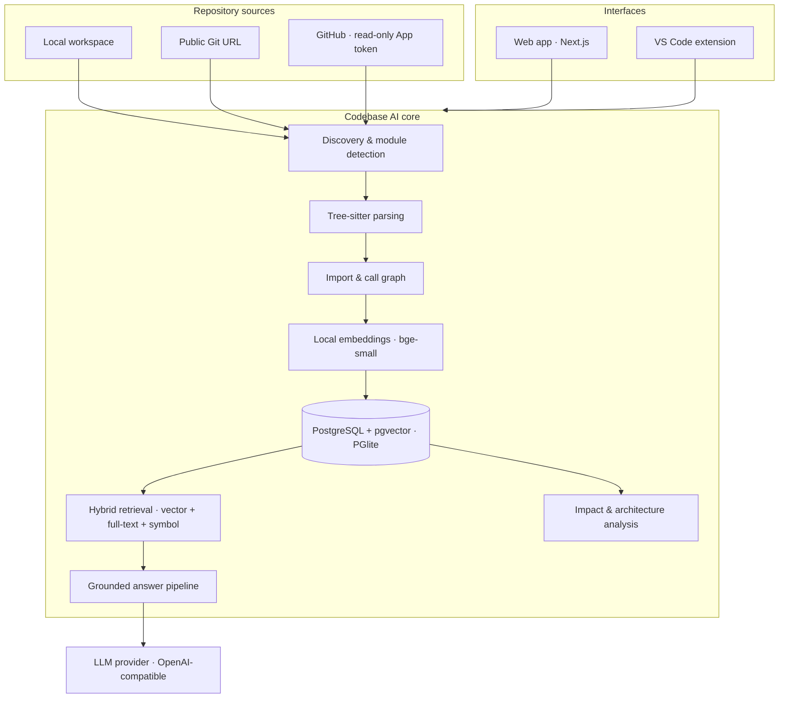
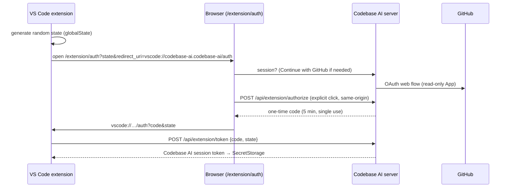

# Codebase AI — Project Analysis

> A code intelligence platform that turns any Git repository into a searchable, structured model of the codebase. It answers architecture, flow, dependency and change-impact questions with exact source citations, from the web or inside VS Code.

---

## 1. Executive summary

| | |
|---|---|
| **What it is** | A retrieval-augmented assistant for codebases. It parses a repository with Tree-sitter, builds a dependency graph, embeds every code entity locally and stores it all in PostgreSQL + pgvector. Answers to natural-language questions are grounded in the retrieved code. |
| **Who it's for** | Developers joining unfamiliar codebases, tech leads doing change planning, reviewers, consultants and students. |
| **Differentiator** | Structure-aware retrieval (functions, routes, call graph, impact analysis) combined with grounded, verifiable answers. It is not a generic chatbot with files pasted into its context. |
| **Surfaces** | Web app (dashboard, chat, architecture graph, code explorer, API routes, impact analysis) and a VS Code extension. |
| **Repository sources** | Local folders (no account required), public Git URLs, and GitHub, including private and organization repositories through read-only GitHub App access. |
| **Privacy posture** | Parsing, embeddings and the vector index run on the user's machine. Only the retrieved snippets for a question go to the configured LLM provider. |
| **Status** | Working MVP. Typecheck, lint and production build pass, 13/13 automated tests pass, and it was verified end to end on real TypeScript, Python and Go repositories and inside a real VS Code instance. |

---

## 2. Problem and value

Onboarding onto a codebase is slow because knowledge is spread across thousands of files, routes, configs and implicit call chains. Keyword search only helps once you already know the vocabulary.

Codebase AI answers questions like:

- *Where is authentication handled?* → exact functions, files and line ranges
- *How does login work?* → the request flow from route to service to token generation
- *What would be affected if I changed `createUser`?* → callers ranked HIGH, MEDIUM or LOW, with reasons
- *Show me all API routes.* → routes detected across frameworks
- *Explain the architecture.* → modules, their connections, entry points and frameworks

Every claim is tied to a numbered source (`[S1]`) that opens the code at the cited lines.

---

## 3. Feature inventory

### 3.1 Web application

| Area | Capabilities |
|---|---|
| **Connect** | Paste a Git URL or local path; search GitHub; *Continue with GitHub* to list personal, organization and collaborator repositories (public and private) and analyze them in one click. |
| **Ingestion progress** | Live step-by-step progress: files discovered, functions, classes and routes extracted, dependency graph, embeddings, index written. |
| **Overview** | Languages, frameworks, entry points, largest and most-connected modules, potentially complex files, index statistics, tailored starter questions, source and visibility (Private/Public/Local), last-indexed time, **Re-index**, **Open in VS Code**, delete. |
| **Ask AI** | Streaming answers with query-type and evidence-strength badges, clickable `[S#]` citations, clickable `path:lines` references, a side-by-side code panel, a sources list, a grounding check, conversation history and follow-ups about a selected symbol. |
| **Architecture** | Interactive module graph built from imports and calls (zoom, pan, search). Selecting a module highlights its dependencies and dependents; drill-down shows file-level graphs. |
| **Files** | File tree with filter, Monaco viewer with highlighted line ranges, symbol outline, go-to-symbol, and a dependency panel (depends on / used by / imported by) with *Ask AI* and *Impact* actions. |
| **API Routes** | All detected HTTP endpoints with method, path, handler and location, plus inline source preview and *Ask how this endpoint works*. |
| **Dependencies & Impact** | Pick any function or class to get a HIGH/MEDIUM/LOW impact breakdown with reasons, importing files, a dependency tree and *Explain impact with AI*. |
| **Account** | GitHub sign-in, manage repository access, sign out, disconnect (revokes the token). |
| **Themes & responsiveness** | Light and dark themes via system preference; layouts verified at desktop and 375 px mobile widths. |

### 3.2 VS Code extension

| Command | Behavior |
|---|---|
| Ask About This Codebase | Webview chat that streams answers; citations open files in the editor at the cited lines. |
| Analyze Repository | Indexes the open folder locally (includes uncommitted changes, no sign-in). If the folder has a GitHub remote, the GitHub copy can be chosen instead. |
| Select Repository | Links the window to any Codebase AI project, including private GitHub projects when signed in. |
| Re-index Repository | Rebuilds the linked project's index. |
| Sign In / Sign Out | Browser-based sign-in handoff; the session token is kept in VS Code SecretStorage. |
| Connect GitHub | Opens GitHub sign-in on the web app. |
| Open Dashboard | Opens the linked project in the web app. |

Also included:
- A status bar item showing project, visibility and index status, which updates while indexing.
- Automatic workspace recognition by local path or normalized GitHub `origin` remote.
- A `vscode://` deep-link handler for **Open in VS Code** from the web.

---

## 4. Architecture



**Design principles**
- **A single Next.js application** hosts the UI and API routes. Heavy native and WASM packages (PGlite, tree-sitter, transformers.js, onnxruntime) are marked as server externals.
- **Repository sources are isolated from the core.** Each source materializes a directory, and the same pipeline indexes it, so new providers (GitLab, Bitbucket) plug in without touching parsing or retrieval.
- **The model provider sits behind a small abstraction** (`streamChat`) targeting any OpenAI-compatible endpoint.
- **Process-wide singletons** hold the database, parser and embedder on `globalThis`. They survive dev hot reloads and reset themselves on failed initialization.

### Code layout

```
app/                  Next.js pages (landing, /repo/[id]/*, /extension/auth) and API routes
components/           repo shell & ingestion progress, Monaco code viewer, GitHub account controls
lib/db                PGlite + pgvector schema (additive migrations) and query helpers
lib/repository        repository sources, GitHub API client, discovery, ingestion pipeline
lib/parser            Tree-sitter entity extraction per language
lib/graph             import resolution and call resolution
lib/embeddings        local embedding model + identifier tokenization
lib/retrieval         query classification, hybrid search, dependencies, impact, architecture graphs
lib/ai                OpenAI-compatible streaming client, grounded answer pipeline
lib/auth              GitHub sign-in, encryption, sessions, repository access control
extension/            VS Code extension (commands, URI handler, Ask panel, smoke test)
tests/                unit + integration tests (node:test via tsx)
```

---

## 5. Ingestion pipeline

| Step | Implementation |
|---|---|
| **1. Connect** | `sourceFor(repo)`: a local path is used in place; a Git URL is shallow-cloned (`--depth 1`); a GitHub source is cloned with the user's token injected as a one-time HTTP header through git's environment config. Records commit SHA and branch. |
| **2. Discover** | Recursive walk that skips `node_modules`, build outputs, virtualenvs, lockfiles, minified files, source maps and `.d.ts`. Limits: 6,000 files and 512 KB per file. Classifies about 40 languages and separates source from config and docs. |
| **3. Module detection** | Derives a logical module from the path: strips source roots (`src`, `lib`, `app`, `internal`, Java package prefixes), unwraps feature containers (`routes/auth` → `auth`), and handles monorepo roots (`packages/x`). |
| **4. Parse** | Tree-sitter WASM grammars for TypeScript, TSX, JavaScript, Python, Java and Go extract functions, methods, classes, interfaces, types, enums, React components, data models, API routes, imports and call sites. Top-level bootstrap code becomes a *module* entity. Other files are chunked (Markdown by heading, others in 60-line windows). |
| **5. Route detection** | Express/Koa/Fastify/Hono style calls, Next.js App and Pages router handlers, FastAPI/Flask decorators (including `APIRouter(prefix=…)` and `Blueprint(url_prefix=…)`), Spring `@*Mapping` with class prefixes, NestJS decorators with `@Controller` prefixes, and Go `net/http`, Gin, Echo, Chi and Fiber routers. |
| **6. Dependency graph** | *Imports:* relative and alias (`@/`, `~/`) resolution with extension probing for JS/TS, dotted and relative modules for Python, package suffix index for Java, directory match for Go. *Calls:* resolved by name, preferring the same file, then imported files, then a unique global match (≤2 candidates), at most 3 targets. Route handlers get `handles` edges. |
| **7. Embeddings** | `Xenova/bge-small-en-v1.5` (q8, 384 dimensions) runs locally in batches of 32. Each entity is embedded from its type, name, parent, route, path, split identifiers and the first 1,200 characters of code. |
| **8. Store** | One transaction replaces the repository's files, entities (with a weighted `tsvector`: name A, path B, content D) and pgvector embeddings, plus relationships and file imports. Entity IDs are pre-allocated for bulk inserts. |
| **9. Statistics** | Language share by lines, frameworks from manifests, entry points, largest, most-connected and complex modules and files. |

**Measured on real repositories (this build)**

| Repository | Stack | Source files | Functions | Classes/interfaces | API routes | Call edges | Imports |
|---|---|---|---|---|---|---|---|
| gothinkster/node-express-realworld-example-app | TypeScript · Express · Prisma | 43 | 35 | 9 | 20 | 90 | 49 |
| fastapi/full-stack-fastapi-template | Python · FastAPI · React | 149 | 422 | 60 | 23 | 526 | 171 |
| gothinkster/golang-gin-realworld-example-app | Go · Gin | 23 | 167 | 26 | 25 | 536 | 74 |

- The Express repository went from clone to *ready* in about five seconds.
- Local embedding throughput was 64 snippets in about 175 ms after a one-time model load.

---

## 6. Retrieval and question answering


1. **Query understanding.** Nine types: location, flow, dependency, impact, implementation, debugging, architecture, routes, general. The type changes retrieval and context.
2. **Hybrid retrieval.** Three signals are fused with Reciprocal Rank Fusion (k = 60):
   - pgvector cosine search (top 40), weight 1.0.
   - PostgreSQL full-text search over split identifiers (top 40), weight 0.8.
   - Exact symbol matching: weight 3.0 for code-like identifiers in the question, 1.2 for plain words.
3. **Metadata filtering.** Docs and config ×0.6 for code questions, raw chunks ×0.8, tests and generated code ×0.5 unless the question is about tests. Architecture questions boost docs and module entities ×1.3; route questions boost routes ×1.5.
4. **Dependency expansion.** Callers and callees of the top five hits are added, ranked by connectivity: up to 8 for flow questions, 5 otherwise.
5. **Type-specific context.**
   - Impact and dependency questions resolve the target symbol and include the full impact analysis.
   - Architecture questions include module statistics.
   - Route questions include the route index.
6. **Context construction.** Numbered evidence blocks with symbol, location, module and the reason each was retrieved, with line-numbered code, capped by `MAX_CONTEXT_CHARS` (default 24,000).
7. **Grounded generation.** The system prompt requires `[S#]` citations and forbids invented paths or symbols. It also requires stating missing evidence explicitly and marking inferences.
8. **Verification.** After streaming, file paths that don't exist in the repository and citations to non-existent sources are flagged in the UI.
9. **Streaming protocol.** NDJSON events: `meta` (query type, sources, evidence strength), `delta`, `verification`, `error`.

**Example results (this build)**
- *"Where is authentication handled?"* (Express): the top 8 sources were all authentication middleware, controller and service code. The answer arrived in about 7 s, with every claim cited and an explicit note about what could not be verified.
- *"What would be affected if I changed GenToken?"* (Go): the exact target was resolved with strong evidence. The answer listed direct callers (HIGH) and transitive article endpoints (MEDIUM) in about 17 s.
- *"What depends on verifySessionToken?"* (plain local folder, no git): the answer was `requireUser` (HIGH), then `handleProfile` (MEDIUM).

### Model configuration

Any OpenAI-compatible endpoint works. The current setup uses OpenRouter with `openai/gpt-5.6-luna` as the primary model and `cohere/north-mini-code:free` as an automatic fallback, with a 2,000-token answer cap.

Benchmark on a grounded prompt:

| Model | Latency | Citations |
|---|---|---|
| openai/gpt-5.6-luna | 6.8 s | ✓ detailed |
| google/gemini-3.8-flash | 4.6 s | ✓ |
| cohere/north-mini-code:free | 5.7 s | ✓ concise |

---

## 7. Structural analysis

- **Change impact.**
  - Breadth-first traversal over incoming `calls` and `handles` edges up to depth 3: depth 1 is HIGH, depth 2 MEDIUM, depth 3 LOW.
  - Classes include all of their methods as seeds.
  - Each result carries a human-readable reason ("directly calls X()", "calls Y(), which depends on X").
  - Importing files that aren't already covered are listed separately.
- **Dependency explorer.** For each entity: depends on, used by, external packages, file imports and importers.
- **Architecture graphs.** The module graph aggregates cross-module import and call edges with weights; file graphs show a module's files plus neighboring files from other modules. Layout uses Dagre, rendered with React Flow.
- **Suggested questions.** Generated from what the index actually contains: authentication, registration, database, payment symbols, detected routes, and the most-referenced function.

---

## 8. GitHub integration and access model

| Concern | Design |
|---|---|
| **Permissions** | A GitHub App with *Contents: read* and *Metadata: read* only. No push, delete or settings access. |
| **Sign-in** | Server-side web flow with a random state in an httpOnly cookie scoped to the auth path (10 minutes). Callback handling covers denial, invalid state and post-install redirects. |
| **Token storage** | AES-256-GCM encryption at rest (key from `CODEBASE_AI_SECRET` or a generated key file). Expiring GitHub App tokens refresh with a single in-flight refresh per connection. |
| **Sessions** | Random tokens stored only as SHA-256 hashes: web sessions last 7 days (httpOnly, SameSite=Lax cookie), extension sessions 30 days (Bearer). |
| **Repository listing** | GitHub App installations (personal, organization, collaborator), with a fallback to `/user/repos` for classic OAuth tokens. Each repository is annotated with its Codebase AI index status. |
| **Private repository access** | Enforced on every repository API route. GitHub is asked whether the requesting user can read the repository (cached 5 minutes), so collaborators work and revoked access is detected. Denials return typed codes: `auth_required`, `reauth_required`, `access_revoked`, `github_unavailable`. |
| **Private listing** | Private indexes are listed only for the connection that indexed them. |
| **Cloning** | The token is passed as `http.extraheader` through `GIT_CONFIG_*` environment variables with credential helpers disabled. It never appears in the clone URL, `.git/config`, process arguments or stored credentials. |
| **Disconnect** | Revokes the token with GitHub and deletes the connection, all sessions and pending codes. |

---

## 9. VS Code handoff



- **Redirect allow-list:** codes are only delivered to `vscode://` or `vscode-insiders://codebase-ai.codebase-ai/auth`.
- **Token scope:** the GitHub token never leaves the server, and the extension only sends its own token to the configured server URL.
- **Web → VS Code:** `vscode://codebase-ai.codebase-ai/project?id=<id>` links the matching open folder. Otherwise the extension offers to clone (with the developer's own Git credentials), open a folder, or ask without a local copy.
- **Workspace recognition:** a read-only `git config --get remote.origin.url`, normalized from SSH, HTTPS and credential-embedded forms.

---

## 10. Data model

| Table | Purpose | Key columns |
|---|---|---|
| `repositories` | Indexed projects | `id`, `name`, `url`, `branch`, `commit_sha`, `status`, `progress` (JSONB), `stats` (JSONB), `metadata` (JSONB), `provider`, `provider_repository_id`, `private`, `owner_connection_id`, `indexed_at` |
| `files` | Discovered files | `repository_id`, `path`, `language`, `module`, `size`, `line_count` |
| `code_entities` | Retrieval units | `file_path`, `symbol_name`, `symbol_type`, `start_line`, `end_line`, `content`, `module`, `parent`, `exported`, `route`, `imports`, `search` (tsvector, GIN), `embedding` (vector 384) |
| `relationships` | Call graph | `source_entity_id`, `target_entity_id`, `relationship_type` (`calls`, `handles`) |
| `file_imports` | Module graph | `source_file`, `target_file` |
| `github_connections` | Linked GitHub accounts | `github_user_id`, `login`, `access_token_enc`, `refresh_token_enc`, `token_expires_at` |
| `sessions` | Web and extension sessions | `token_hash`, `connection_id`, `kind`, `expires_at` |
| `extension_auth_codes` | VS Code handoff | `code_hash`, `connection_id`, `state`, `expires_at`, `used_at` |

All schema changes are additive (`CREATE … IF NOT EXISTS`, `ADD COLUMN IF NOT EXISTS`). Deleting a repository cascades to its files, entities, embeddings and graph, and removes the clone.

---

## 11. API surface

| Method | Endpoint | Purpose |
|---|---|---|
| GET / POST | `/api/repositories` | List (private filtered by owner) · create from URL, local path or `{ github: "owner/repo" }` |
| GET / DELETE | `/api/repositories/:id` | Status, progress, stats, suggestions · delete with all data |
| POST | `/api/repositories/:id/index` | Manual re-index |
| GET | `/api/repositories/:id/files` | File list, or file content + symbols |
| GET | `/api/repositories/:id/entities` | Symbol search, routes, most-referenced entities |
| GET | `/api/repositories/:id/entities/:entityId` | Entity with dependencies |
| POST | `/api/repositories/:id/query` | Grounded answer (NDJSON stream) |
| GET | `/api/repositories/:id/architecture` | Module or file graph |
| POST | `/api/repositories/:id/impact-analysis` | Change impact |
| GET | `/api/github/search` | Public GitHub repository search |
| GET | `/api/github/repositories` | Repositories the signed-in user can access |
| GET | `/api/auth/github/login` · `/api/auth/github/callback` | GitHub sign-in |
| GET | `/api/auth/session` | Current user (cookie or Bearer) |
| POST | `/api/auth/logout` | Sign out or disconnect |
| POST | `/api/extension/authorize` · `/api/extension/token` | VS Code handoff |

---

## 12. Security and privacy review

| Risk | Mitigation | Verified by |
|---|---|---|
| Leaking private code to other users | Access check on every repository route; private listing scoped to owner; GitHub consulted for each reader | Integration tests (signed out, outsider, collaborator, revoked) |
| Token theft from storage | AES-256-GCM encryption; sessions stored only as hashes | Integration test inspects stored rows |
| Token exposure to the browser or extension | Tokens never serialized in responses; extension receives its own token | Integration test asserts the GitHub token is absent from the exchange |
| CSRF / login fixation | OAuth state cookie; SameSite=Lax sessions; same-origin check on code issuance; explicit click to authorize | Integration test (cross-origin rejected) |
| Open redirects / code interception | Return paths restricted to same-origin relative paths; codes only to the extension URI; state binding; 5-minute single-use codes | Unit + integration tests |
| Token leakage via git | Environment-config header, credential helpers disabled, no token in URL, config or arguments | Unit test |
| Path traversal | File API serves only indexed paths resolved inside the clone; extension guards resolved paths | Code review |
| Prompt exposure to LLM | Only retrieved snippets within a character budget are sent | Code review |
| Hallucinated references | Citation-constrained prompt and post-answer verification of paths and citations | Manual verification on real repositories |
| Secrets in the repository | `.env*` (except the example), `.data/` and extension build output are gitignored | Git ignore checks |

**Residual risks**
- The development server listens on the local network by default. Binding to `127.0.0.1` is recommended on shared networks.
- Public and local projects are visible to anyone who can reach the server; this is a single-user local tool by design.
- Free LLM fallback providers may log prompts. For sensitive code, use a paid provider with a no-logging policy.

---

## 13. Quality and testing

| Check | Result |
|---|---|
| TypeScript (`tsc --noEmit`) | Pass |
| ESLint (app, components, lib, tests) | 0 problems |
| Production build (`next build`) | Pass |
| `npm test` | **13/13 pass**: 5 integration (sessions, private access, listing, VS Code handoff, disconnect) and 8 unit (URL/remote parsing, encryption, redirect guards, git credential isolation) |
| VS Code extension host smoke test (VS Code 1.135) | Extension activates, all 8 commands register, workspace auto-links to its project from the GitHub `origin` remote |
| End-to-end regressions | Existing API routes return 200; re-index returns 202 (and 409 while one is already running); a local non-git folder indexes signed out, and deleting the project leaves the folder intact |
| UI audit | Desktop and mobile widths, light and dark themes; overflow checks show no horizontal overflow; no console errors from application code |

---

## 14. Technology stack

| Layer | Technology |
|---|---|
| Web framework | Next.js 16 (App Router, Turbopack), React 19, TypeScript, Tailwind CSS 4 |
| Database | PGlite (PostgreSQL in WASM) + pgvector, full-text search |
| Parsing | web-tree-sitter + prebuilt WASM grammars |
| Embeddings | transformers.js (onnxruntime), bge-small-en-v1.5 |
| LLM | Any OpenAI-compatible Chat Completions API (currently OpenRouter) |
| Visualization | React Flow, Dagre, Monaco Editor, react-markdown |
| Extension | VS Code API (TypeScript), SecretStorage, URI handler, webview |
| Testing | node:test via tsx, extension-host smoke test |

### Configuration

| Variable | Purpose |
|---|---|
| `LLM_BASE_URL`, `LLM_API_KEY`, `LLM_MODEL` | Answer generation provider |
| `LLM_FALLBACK_MODELS`, `LLM_MAX_TOKENS`, `MAX_CONTEXT_CHARS` | Reliability and cost controls |
| `GITHUB_CLIENT_ID`, `GITHUB_CLIENT_SECRET`, `GITHUB_CALLBACK_URL`, `GITHUB_APP_SLUG` | GitHub App sign-in |
| `GITHUB_TOKEN` | Optional higher limits for public GitHub API calls |
| `CODEBASE_AI_SECRET` | Optional encryption key for stored tokens |
| `codebaseAI.serverUrl` (VS Code setting) | Server used by the extension |

---

## 15. Limitations

- **No incremental indexing.** Re-indexing rebuilds the whole repository; commit-diff re-indexing isn't implemented.
- **Name-based call resolution.** Dynamic dispatch, dependency injection and reflection can be missed; highly ambiguous names are skipped deliberately.
- **Route prefixes applied at mount time** (for example FastAPI `include_router(prefix=…)` in another file) aren't combined yet.
- **Embedded single-process database.** PGlite suits a local tool; a multi-user deployment would need a PostgreSQL server.
- **Size limits.** Very large repositories are limited to 6,000 files, 512 KB per file and 250 MB repository size.
- **Retrieval ranking can miss.** Some conceptual queries rank the best evidence lower than ideal (e.g. database initialization held in module-level code).
- **GitHub sign-in hasn't run against a live GitHub App yet.** It needs GitHub App credentials; the flow is covered by integration tests with a mocked GitHub API.
- **Online dependencies.** The Monaco editor loads from a CDN, and the embedding model downloads on first use.
- **Extension distribution.** The extension runs from source (F5 or a packaged VSIX) and isn't yet published to the Marketplace.

---

## 16. Roadmap recommendations

| Priority | Item | Value |
|---|---|---|
| High | Incremental re-indexing by commit SHA plus GitHub webhooks | Always-fresh indexes at low cost |
| High | Retrieval evaluation set (question → expected entities) with recall@k tracking | Measurable, protected retrieval quality |
| High | Precise symbol resolution via LSP/SCIP indexes | More accurate call graphs and impact analysis |
| Medium | GitLab and Bitbucket repository sources | Broader team coverage through the existing source abstraction |
| Medium | PostgreSQL server mode + authentication for all projects | Team and hosted deployments |
| Medium | Pull-request impact summaries | Review assistance using the existing impact engine |
| Medium | Marketplace publishing for the extension | One-click install |
| Low | Multi-repository questions across services | Microservice architectures |
| Low | Local LLM option (Ollama) documented end to end | Fully offline operation |

---

## 17. Demo script (about 3 minutes)

1. **Connect.** Paste a repository, or *Continue with GitHub* and pick a private repository. Watch the live analysis steps.
2. **Overview.** Languages, frameworks, entry points, modules, suggested questions.
3. **Ask.** *"Where is authentication handled?"* Click `[S1]`; the code opens at the exact lines.
4. **Ask.** *"How does login work?"* The request flow is shown with citations.
5. **Architecture.** Click the `auth` module to see its dependencies and dependents highlighted; drill into its files.
6. **Impact.** *"What would be affected if I changed createUser?"* shows HIGH/MEDIUM callers with reasons.
7. **Open in VS Code.** The workspace links automatically; ask a question in the panel and click a citation to jump to the file.
